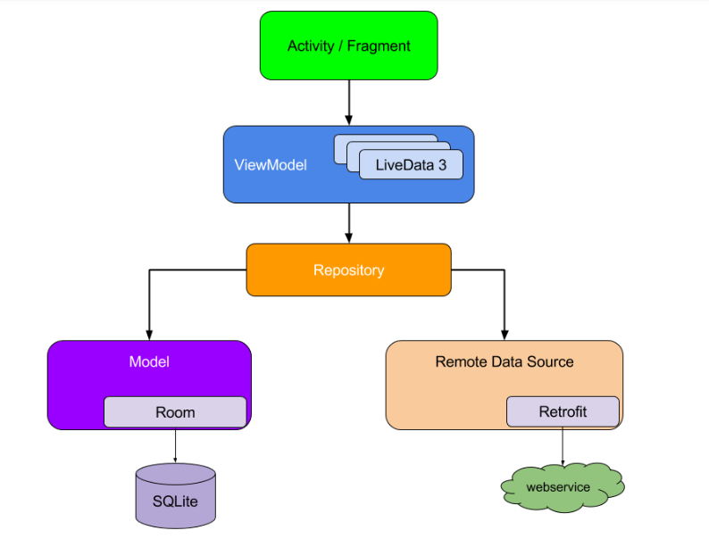

## Jetpack-MVVM-PPJoke
Jetpack MVVM最佳实践 开发短视频应用 客户端  
使用 KunMinX的[开源项目](https://github.com/KunMinX/Jetpack-MVVM-Best-Practice)中架构思想 重构此课程代码

###  Jetpack架构原则
#### 分离关注点

  要遵循的最重要的原则是分离关注点。一种常见的错误是在一个 Activity 或 Fragment 中编写所有代码。这些基于界面的类应仅包含处理界面和操作系统交互的逻辑。您应使这些类尽可能保持精简，这样可以避免许多与生命周期相关的问题。
#### 通过模型驱动界面
另一个重要原则是您应该通过模型驱动界面（最好是持久性模型）。模型是负责处理应用数据的组件。它们独立于应用中的 View 对象和应用组件，因此不受应用的生命周期以及相关的关注点的影响。

### 推荐应用架构

##### 请注意，每个组件仅依赖于其下一级的组件。例如，Activity 和 Fragment 仅依赖于视图模型。存储区是唯一依赖于其他多个类的类；在本例中，存储区依赖于持久性数据模型和远程后端数据源

## [开发笔记](https://git.imooc.com/coding-402/ppjoke_jetpack/src/master/jetpack%e5%ae%a2%e6%88%b7%e7%ab%af%e5%bc%80%e5%8f%91%e7%ac%94%e8%ae%b0.md)

## [服务器&数据库配置文档](https://git.imooc.com/coding-402/ppjoke_jetpack/src/master/%e6%9c%8d%e5%8a%a1%e5%99%a8%e7%8e%af%e5%a2%83%e6%90%ad%e5%bb%ba.md)

