## 服务器环境搭建步

### - 由于我们的服务器已经部署到公网，有需要学习服务器项目的各位同学可以选择性的在自己的电脑上按以下步骤，配置服务器的搭建和数据库数据导入工作。不要担心，非常简单。

### - 软件下载

   *   IDE编译器:[IntelliJ IDEA 2019.2]( https://www.jetbrains.com/idea)，记得选择`Ultimate`版本的
 
   *   数据库：[MySQL(8.0.18)]( https://dev.mysql.com/downloads/file/?id=490317)

   *   数据库可视化工具：[Navigator for MySQL(12.1.19)](https://www.navicat.com.cn/products/navicat-for-mysql/)

   *   数据库数据导入脚本:本仓库根目录下的`ppjoke_database_sql.sql`文件，后面会讲到如何使用

### - 业务服务器项目配置

   - IDE编译器的安装非常简单，咱们这里就不演示了，安装完成之后。打开它。我们选择右侧面板的`Open Project`选择学习资料中的`server`文件夹并打开之。

    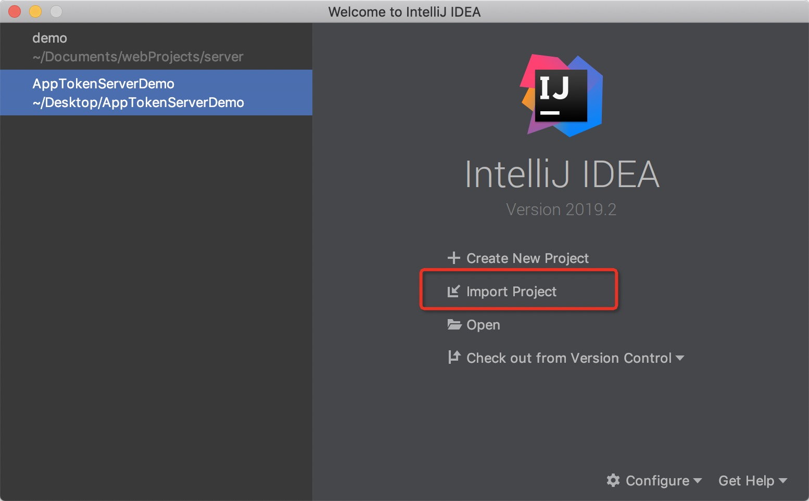

   - 项目打开之后，我们可以第一时间查看`HELP.md`文件。这里面介绍了服务器源码的每一个文件的作用。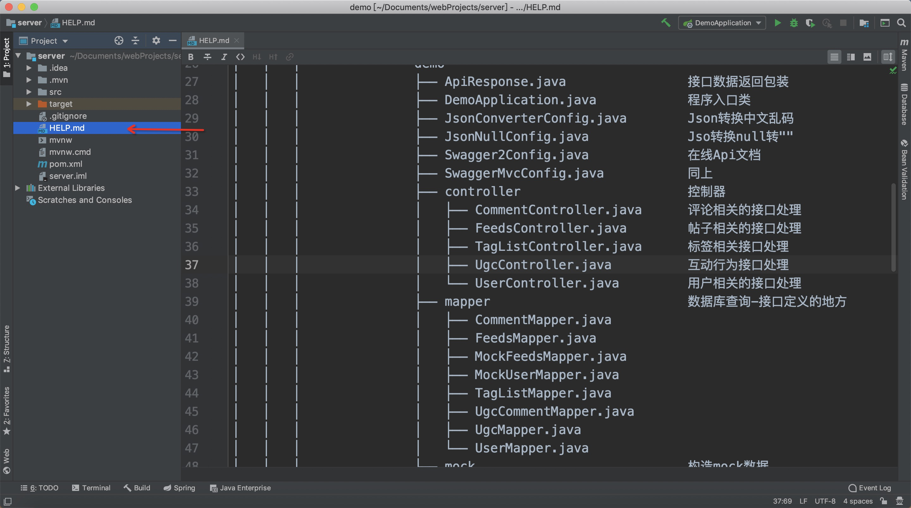

  - 完了之后，我们在开`applicaiton.yml`文件，这里数据库密码需要我们配置。也就是后面安装数据库时所设置的密码，用户名一般都是root。

  - 服务器地址就是本机地址:ipconfig,端口号就是8080,服务器路径/serverdemo，运行服务器的话，只需要点击右上角的绿色三角包即可。

  - <http://localhost:8080/serverdemo/swagger-ui.html#/> 服务器运行起来之后，可以在浏览器中输入上面得地址， 好看Api文档。

  

### - 数据库配置

  - 软件的安装非常简单，咱们这里就不在演示了。但有个步骤需要讲一下,当数据库安装进入到Configration步骤时，选择默认的密码强度，然后点击Next。

    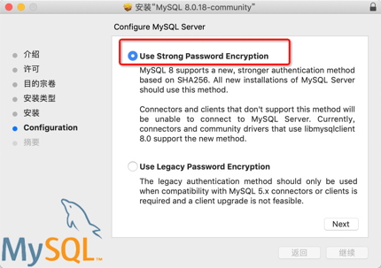

  - 这里是设置密码的地方，8位，必须数字+字符。这里的密码需要配置到服务器项目的`applicaiton.yml`中。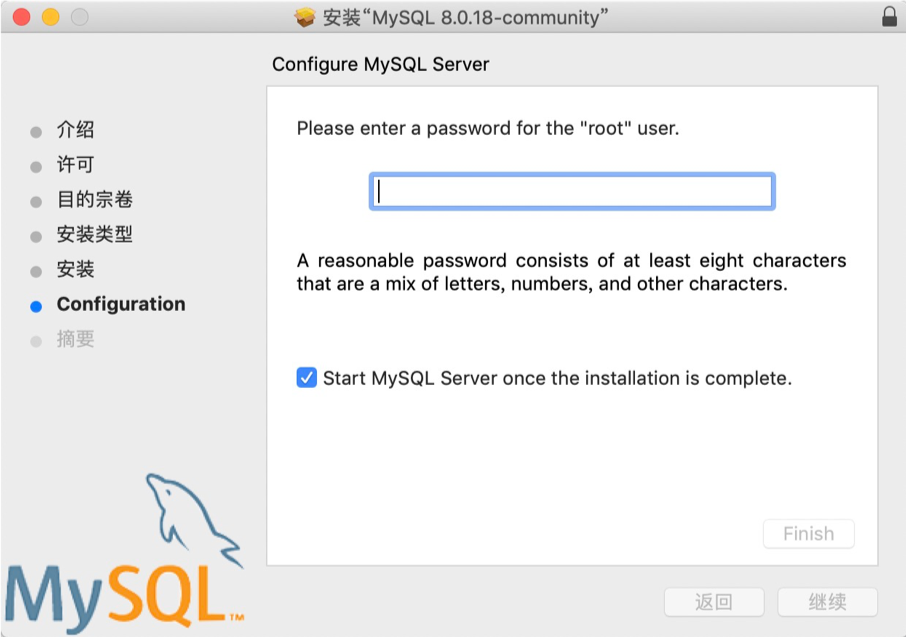

- 数据库数据导入&数据库可视化工具

  - 软件的安装也是非常简单，我们不再演示安装环节。

  - 安装完成之后我们打开软件，点击工具类的左上角的`connection`在弹出的下拉菜单中选择`MySQL`.

  - 然后会弹出下面的面板。
    * Connection Name:随便起，该软件跟数据建立本次链接的名字而已               
    * Add To:你们是没有的,我这因为之前已经建立过链接，所以才会有的。     
    * Host:不需要动                                                                                               * Port：不需要动                                                                                               * UserName:安装数据库的用户名，一般是root                                                  
    * Password:安装数据库时的密码                                                                         
    * 完了之后，点击左下角的`Test Connection`测试链接，如果弹出`Successful`则代表配置正常，最后点击右下角的`SAVE`

    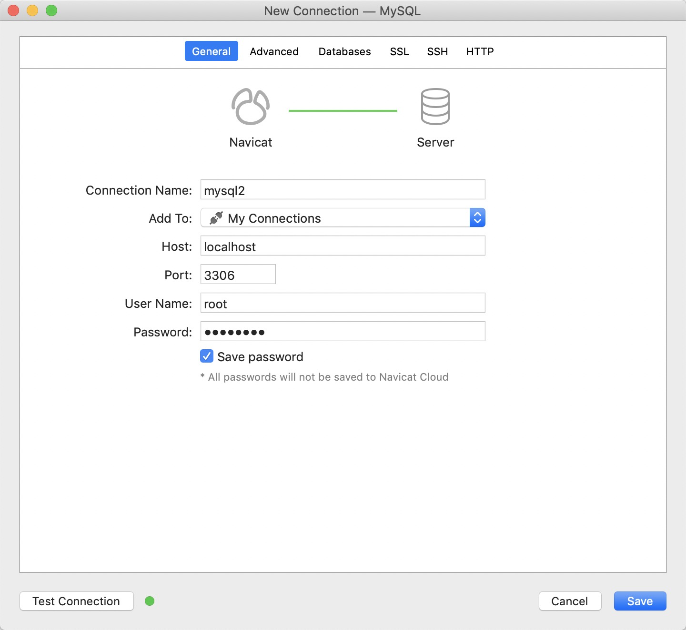

  - 连接建立完成之后，选中连接的名字再右击在面板中选择`Open Connection`

    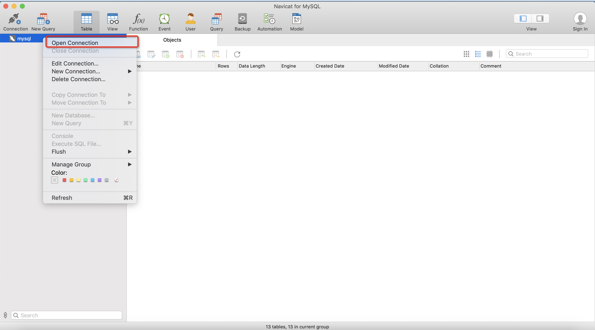

  - 打开之后，在选择连接的名字再右击在面板中选择`New DataBase`

    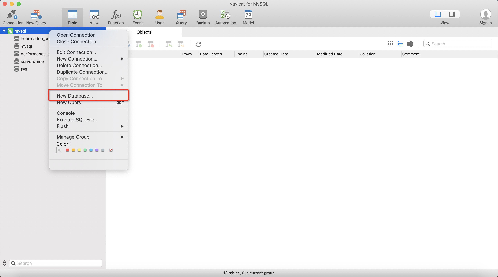

  - 在弹出的面板中必须如下配置，否则数据将导入失败。最后点击OK。数据库就创建成功了，此时还没有数据。

    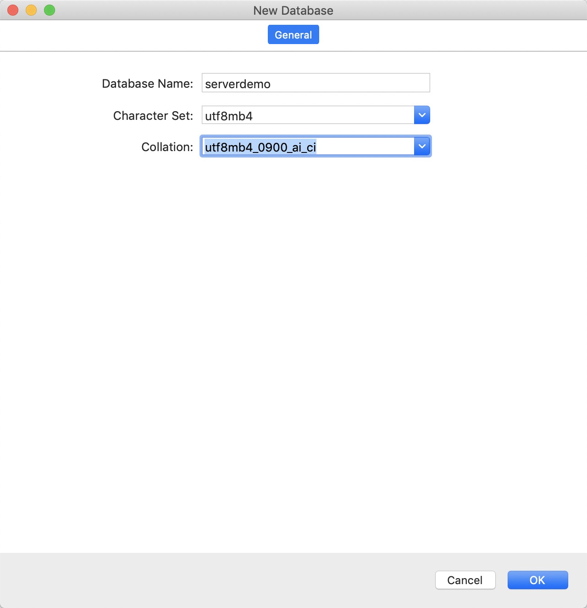

  - 然后我们选中`serverdemo`数据库，并右键在弹出面板中选择`Open DataBase`打开数据库

    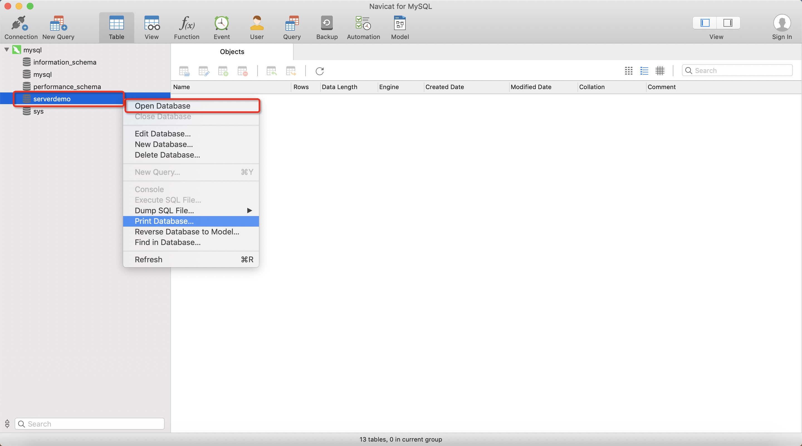

  - 再次选中`serverdemo`数据库，并右键在弹出面板中选择`execute sql file`

    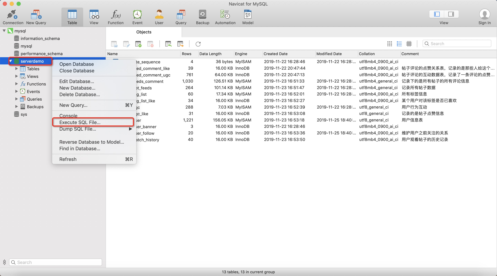

  - 在弹出面板中`file`一栏中 选择数据库数据sql脚本文件`ppjoke_database_sql.sql`,文件在本仓库根目录下，其他的都不需要动，最后点击右下角的`start`开始执行数据的导入。这个流程非常快。不出意外的话，你将在`Message Log`面板中看到`Successful`的字样，代表导入成功。

    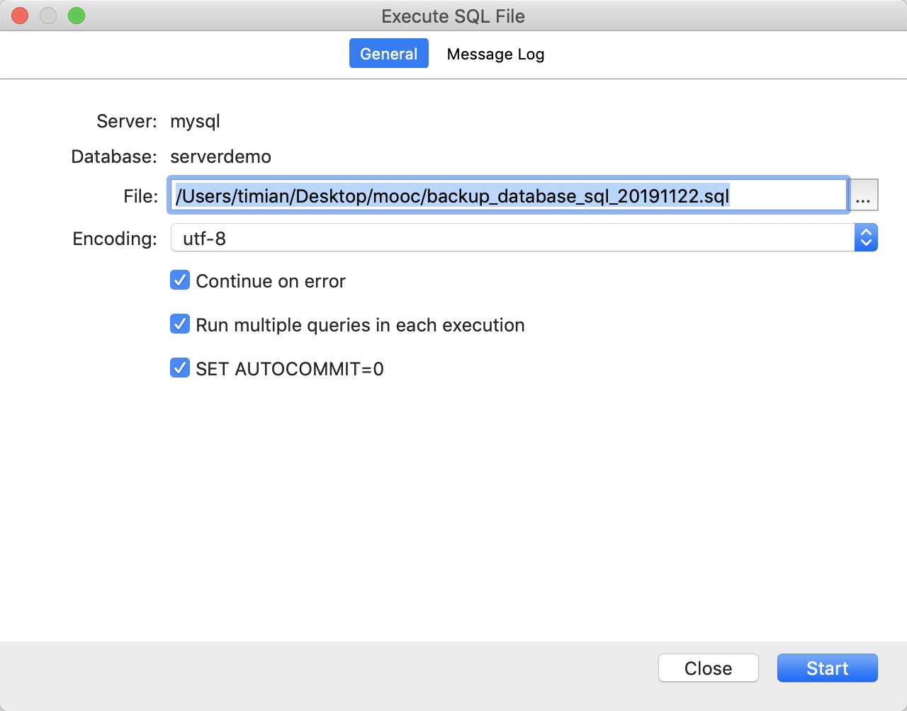

  - 数据导入成功后双击`tables`，会列出很多数据库表。右侧面板中有每一个表的介绍，至此，数据导入的配置工作就算是完成了

    

### - 鉴权服务器

  只需要再IDE中打开`AppTokenServerDemo`文件夹即可，不需要什么配置，当我们需要上传文件时，需要运行起来此服务端程序。服务器地址为本机地址+端口号(默认7080)